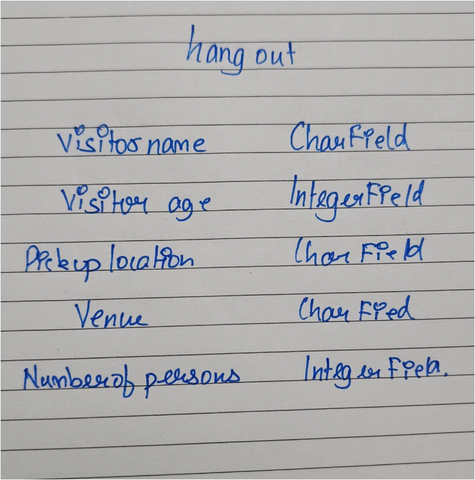
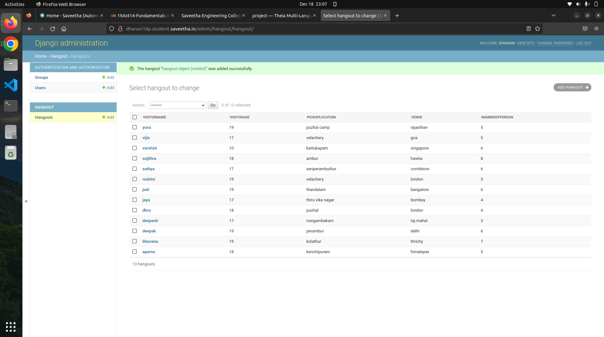

# Django ORM Web Application

## AIM
To develop a Django application to store and retrieve data from a database using Object Relational Mapping(ORM).

## Entity Relationship Diagram



## DESIGN STEPS

### STEP 1:
clone the respoitory to thiea idel. Start a new app inside the project folder

### STEP 2:
Type the appropricate code for your table and provide appropriate data types to the columns

### STEP 3:
create a report about your project in readme.in file and upload the django.orm.app folder to your remote respository 

## PROGRAM
```py
from django.db import models

# Create your models here.
from django.db import models
from django.contrib import admin
# create your models here
class hangout(models.Model):
    visitorname = models.CharField(max_length=10,primary_key=True)
    visitorage = models.IntegerField()
    pickuplocation = models.CharField(max_length=50)
    venue = models.CharField(max_length=30)
    numberofperson = models.IntegerField()

class hangoutAdmin(admin.ModelAdmin):

    list_display = ('visitorname','visitorage','pickuplocation','venue','numberofperson')
Include your code here
```

## OUTPUT

### Adminpage



## RESULT

hence wed evelop a Django application to store and retrieve data from a database using Object Relational Mapping(ORM).
